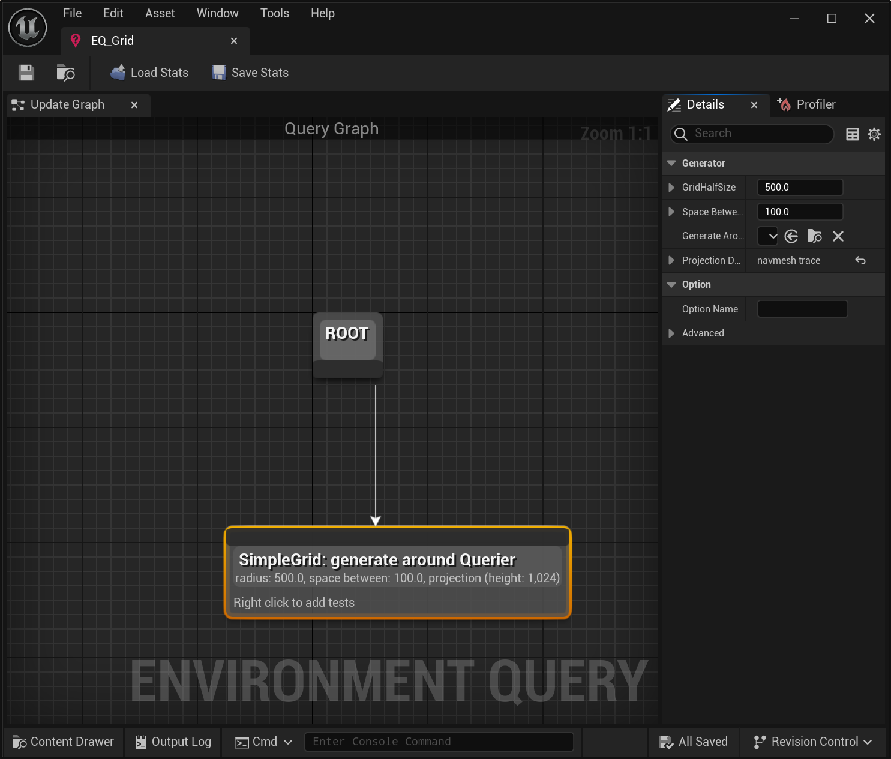

# MASS TEST

实现100个物体随机运动


## ECS相关代码实现

### 增加SimpleMovementFragment

```
USTRUCT()
struct MASSTEST_API FSimpleMovementFragment : public FMassFragment
{
	GENERATED_BODY()

	FVector Target = FVector::ZeroVector;
};
```


### 增加SimpleRandomMovementTrait

```
UCLASS()
class MASSTEST_API USimpleRandomMovementTrait : public UMassEntityTraitBase
{
	GENERATED_BODY()
	
protected:
	virtual void BuildTemplate(FMassEntityTemplateBuildContext& BuildContext, const UWorld& World) const  override;
};

void USimpleRandomMovementTrait::BuildTemplate(FMassEntityTemplateBuildContext& BuildContext, const UWorld& World) const
{
    BuildContext.AddFragment<FSimpleMovementFragment>();
}
```


### 增加SimpleRandomMovementProcessor

```
UCLASS()
class MASSTEST_API USimpleRandomMovementProcessor : public UMassProcessor
{
	GENERATED_BODY()
	
public:
	USimpleRandomMovementProcessor();

protected:
	virtual void ConfigureQueries() override;
	virtual void Execute(FMassEntityManager& EntityManager, FMassExecutionContext& Context) override;

private:
	FMassEntityQuery EntityQuery;	
};

USimpleRandomMovementProcessor::USimpleRandomMovementProcessor()
{
    bAutoRegisterWithProcessingPhases = true;
    ExecutionFlags = (int32)EProcessorExecutionFlags::All;
    ExecutionOrder.ExecuteBefore.Add(UE::Mass::ProcessorGroupNames::Avoidance);
}

void USimpleRandomMovementProcessor::ConfigureQueries()
{
    EntityQuery.AddRequirement<FTransformFragment>(EMassFragmentAccess::ReadWrite);
    EntityQuery.AddRequirement<FSimpleMovementFragment>(EMassFragmentAccess::ReadWrite);
    EntityQuery.RegisterWithProcessor(*this);
}

void USimpleRandomMovementProcessor::Execute(FMassEntityManager& EntityManager, FMassExecutionContext& Context)
{
    EntityQuery.ForEachEntityChunk(EntityManager, Context, ([this](FMassExecutionContext& Context)
    {
        const TArrayView<FTransformFragment> TransformsList = Context.GetMutableFragmentView<FTransformFragment>();
        const TArrayView<FSimpleMovementFragment> SimpleMovementsList = Context.GetMutableFragmentView<FSimpleMovementFragment>();
        const float WorldDeltaTime = Context.GetDeltaTimeSeconds();

        for (int32 EntityIndex = 0; EntityIndex < Context.GetNumEntities(); ++EntityIndex)
        {
            FTransform& Transform = TransformsList[EntityIndex].GetMutableTransform();
            FVector& MoveTarget = SimpleMovementsList[EntityIndex].Target;

            FVector CurrentLocation = Transform.GetLocation();
            FVector TargetVector = MoveTarget - CurrentLocation;

            if (TargetVector.Size() <= 20.f)
            {
                MoveTarget = FVector(FMath::RandRange(-1.f, 1.f) * 1000.f, FMath::RandRange(-1.f, 1.f) * 1000.f, CurrentLocation.Z);
            }
            else
            {
                Transform.SetLocation(CurrentLocation + TargetVector.GetSafeNormal() * 400.f * WorldDeltaTime);
            }
        }
    }));
}
```


## ECS相关资源和蓝图逻辑

### 新建MassEntityConfigAsset


### 在场景中添加MassSpawner对象





### 运行游戏


